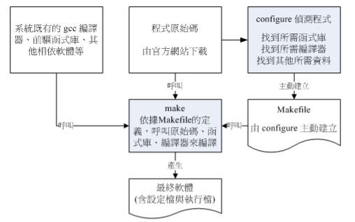

# 开放源码的软件安装

## make与configure 
  

*gcc*  
```bash
gcc hello.c -c #生成.o文件
gcc hello.c -o hello #生成指定文件名的文件
gcc hello.c -lm -L/lib64
-l 加入某函数库
-L/path 在目录下查找函数库
-I/path 在目录下查找相关include文件
-O 根据操作环境给予最佳执行速度
-Wall 警告信息
```

## 安装过程

./configure --help 查看参数
./configure --prefix=/path 即路径，一般来说最重要的就是这个
...

make
make clean
make check
make install

# 动态与静态函数库

*静态函数库特点*  
- 拓展名一般为libxxx.a
- 直接整合进执行程序中，一般可执行文件大小会比较大
- 可执行文件可独立执行
- 升级后，可执行文件需重新编译

*动态函数库特点*  
- 名字一般为libxxx.so
- 动态函数库在编译时，在程序里只有一个【指针】的位置而已
- 可执行文件不能独立执行
- 升级更容易

这些函数库绝大部分放在/lib64 与/lib 中  
另外很多函数库其实内核就提供了，内核的函数库在/lib/modules里

# apt(advanced packing tool)指令

apt [-h -y全选yes -p不显示安装过程] [command] [package]  

- apt update
- apt upgrade
- apt install [package]
- apt show [package]
- apt remove [package]
- apt autoremove 清理不再使用的依赖和库文件 !慎用
- apt purge [package] 移除软件包和配置文件
- apt search [keyword] 查找软件包
- apt list --installed