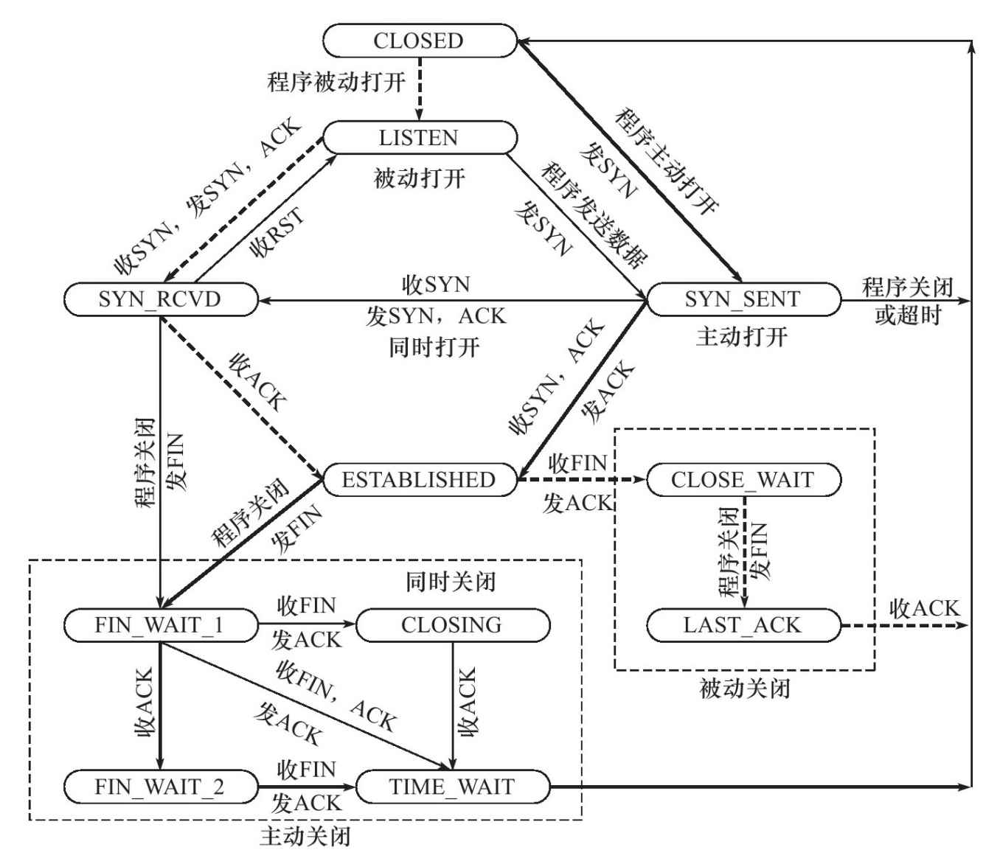
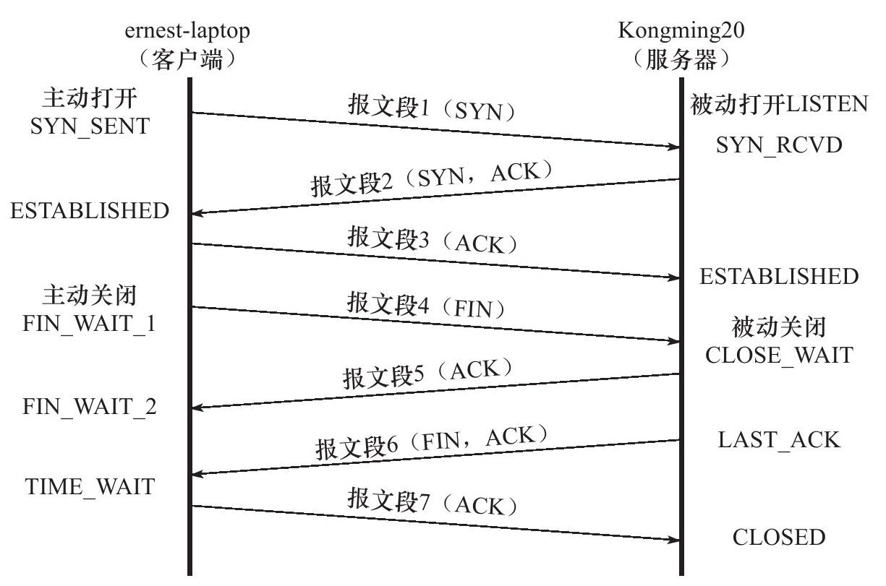

# 知识点

## 字节流服务和数据报服务的区别  
>这种区别对应到实际编程中，则体现为通信双方是否必须执行相同次数的读、写操作（当然，这只是表现形式）。当发送端应用程序连续执行多次写操作时，TCP模块先将这些数据放入TCP发送缓冲区中。当TCP模块真正开始发送数据时，发送缓冲区中这些等待发送的数据可能被封装成一个或多个TCP报文段发出。因此，TCP模块发送出的TCP报文段的个数和应用程序执行的写操作次数之间没有固定的数量关系。

>当接收端收到一个或多个TCP报文段后，TCP模块将它们携带的应用程序数据按照TCP报文段的序号（见后文）依次放入TCP接收缓冲区中，并通知应用程序读取数据。接收端应用程序可以一次性将TCP接收缓冲区中的数据全部读出，也可以分多次读取，这取决于用户指定的应用程序读缓冲区的大小。因此，应用程序执行的读操作次数和TCP模块接收到的TCP报文段个数之间也没有固定的数量关系。

>综上所述，发送端执行的写操作次数和接收端执行的读操作次数之间没有任何数量关系，这就是字节流的概念：应用程序对数据的发送和接收是没有边界限制的。UDP则不然。发送端应用程序每执行一次写操作，UDP模块就将其封装成一个UDP数据报并发送之。接收端必须及时针对每一个UDP数据报执行读操作（通过recvfrom系统调用），否则就会丢包（这经常发生在较慢的服务器上）。并且，如果用户没有指定足够的应用程序缓冲区来读取UDP数据，则UDP数据将被截断。

## TCP状态





# 内核参数功能

- /proc/sys/net/ipv4/ip_forward 是否转发IP数据报
- /proc/sys/net/ipv4/conf/all/send_redirects 是否允许发送ICMP重定向报文
- /proc/sys/net/ipv4/conf/all/accept_redirects 是否允许接收ICMP重定向报文（一般主机只收，服务器只发送）
- /proc/sys/net/ipv4/tcp_window_scaling 启用或关闭窗口扩大因子选项
- /proc/sys/net/ipv4/tcp_syn_retries tcp重连次数


# 相关指令

*arp*高速缓存  
```bash
arp 
arp -a
sudo arp -d 192.168.1.109 删除ip对应的arp项
sudo arp -s 192.168.1.109 08:00:27:53:10:67 添加对应的缓存项
```

*tcpdump*抓包  
```bash
sudo tcpdump -i [接口] ...

```


*route*
```bash
route 查看路由表
route add-host 192.168.1.109 dev eth0 路由表更新
route del-net 192.168.1.0 netmask 255.255.255.0
route del default
route add default gw 192.168.1.109 dev eth0

```

*nc*(net cat)
