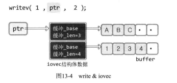

# socket基础

## 文件操作

int open(const char *path, int flag);

- flag文件打开模式，如O_CREATE|O_TRUNC|O_RDONLY
    + O_CREATE:必要时创建文件
    + O_TRUNC:删除全部数据
    + O_APPEND
    + O_RDONLY
    + O_WRONLY
    + O_RDWR
- 成功时返回fd，失败返回-1

int close(int fd);

ssize_t write(int fd, const void *buf, size_t nbytes);

- buf要传输数据的地址
- nbytes要传输的字节数

ssize_t read(int fd, void *buf, size_t nbytes);

- buf要保存接收数据的地址

## socket函数及数据类型

```c
#include <sys/socket.h>
int socket(int domain, int type, int protocol);
```

- domain此套接字要使用的协议族信息，主要为PF_INET?AF_INET
- type数据传输的类型，流式SOCK_STREAM，或数据报式SOCK_DGRAM
- protocol协议，IPPROTO_TCP或IPPROTO_UDP
- 成功时返回fd，失败时返回-1

sockaddr_in

- sa_family_t       sin_family; 地址族
- uint16_t          sin_port; 
- struct in_addr    sin_addr;
- char              sin_zero[8]; 作为填充，不使用（为了和sockaddr结构体保持一致）

sockaddr

- sa_family_t       sin_family;
- char              sa_data[14]; 地址信息（此结构体不专为IP设计）

## 字节序Endian

大端序（网络序）：高位字节存到低地址
小端序（主机序）：高位字节存到高地址

unsigned short htons(unsigned short);
unsigned short ntohs(unsigned short);
unsigned long htonl(unsigned long);
unsigned long ntohl(unsigned long);

h:host
n:network
s,l:shot,long(linux中long为4字节)

## 网络地址的初始化与分配

\#include <arpa/inet.h>  
in_addr_t inet_addr(const char *string);

- 成功时返回32位 **大端**序整数型值，失败时返回INADDR_NONE
- 可以检测无效的ip地址，如某字节256

int inet_aton(const char *string, struct in_addr *addr);

- 成功时返回1，失败返回0
- 使用频率更高，因为in_addr_t使用时需要将转换后的IP再代入sockaddr_in中，而inet_aton则帮你做好了

char * inet_ntoa(struct in_addr adr);

- 成功时返回字符串地址，失败时返回-1
- 注意，返回的为char指针，但函数未向程序员要求分配内存，因此调用完后，应立即将字符串信息复制到其他内存空间

*网络地址初始化*  
```c
struct sockaddr_in addr;
char *serv_port = "9190" 
memset(&addr, 0, sizeof(addr)) //将addr的所有成员初始化为0
addr.sin_family = AF_INET；
addr.sin_addr.s_addr = htonl(INADDR_ANY); //基于字符串的IP地址初始化
addr.sin_port = htons(atoi(serv_port)); //基于字符串的端口号初始化
```
利用常数INADDR_ANY分配服务器端的IP地址，则可自动获取运行服务器端的计算机IP地址  
而且，若同一计算机中已分配多个IP地址（如路由器），只要端口号一致，就可以从不同IP地址接收数据

*分配地址*  
\#include <sys/socket.h>  
int bind(int sockfd, struct sockaddr *myaddr, socklen_t addrlen);

- sockfd要分配地址信息的套接字文件描述符
- myaddr，存有地址信息的结构体变量
- 结构体变量的长度
- 成功时返回1，失败时返回-1

*等待进入连接状态*  
\#include <sys/socket.h>  
int listen(int sock, int backlog);

- sock希望进入listen态的套接字fd
- backlog连接请求等待队列的长度，若为5，则队列长度为5，表示最多使5个连接请求进入队列
- 成功时返回1，进入等待连接请求状态；失败时返回-1

*受理客户端连接请求*  
int accept(int sock, struct sockaddr *addr, socklen_t *addrlen);

- addr保存发起连接请求的客户端地址信息的变量，调用函数后会将客户端地址信息填充入此变量
- addrlen为第二个参数addr结构体的长度
- 成功时返回套接字fd，失败时返回-1

*发起连接请求*  
int connect(int sock, struct sockaddr *servaddr, socklen_t addrlen);

- serv_addr保存目标服务器地址信息
- servaddr长度
- 成功时返回0，失败时返回-1

## UDP相关函数

\#include <sys/socket.h>  
ssize_t sendto(int sock, void *buff, size_t nbytes, int flags, struct sockaddr *to, socklen_t addrlen);

- sock用于传输数据的UDP套接字fd
- flags可选项参数，若无则传递0
- to目标地址

\#include <sys/socket.h>  
ssize_t recvfrom(int sock, void *buf, size_t nbytes, int flags, struct sockaddr *from, socklen_t *addrlen*)

创建已连接UDP套接字（注册了目标地址信息的套接字）：  
对UDP套接字调用connect函数，注册地址信息  
connect(sock, (struct sockaddr *)&adr, sizeof(adr));

## 优雅地断开连接

一旦两台主机间建立了套接字连接，每个主机就会拥有单独的输入流和输出流  
close()会同时断开这两个流，而shutdown()则可以关闭其中一个  
\#include <sys/socket.h>  
int shutdown(int sock, int howto);

- sock需要断开的套接字fd
- howto传递断开方式信息
    + SHUT_RD断开输入流
    + SHUT_WR断开输出流
    + SHUT_RDWR同时断开

## 域名和IP地址的获取

域名->IP  
\#include <netdb.h>  
struct hostent *gethostbyname(const char *hostname);

- 成功时返回hostent结构体，失败时返回NULL指针
- struct hostent
    + char *h_name          official name
    + char **h_aliases      alias list
    + int h_addrtype        host address type
    + int h_length          address length，IPv4时为4byte
    + char **h_addr_list    address list

IP->域  
\#include <netdb.h>  
struct hostent *gethostbyaddr(const char* addr, socklen_t len, int family);

- addr包含IP地址信息的in_addr指针，为了传递IPv4外的信息，类型被声明为char指针
- family地址族，IPv4为AF_INET，ipv6为AF_INET6


## 套接字多种可选项


# 多种IO函数

\#include <sys/socket.h>  
ssize_t send(int sockfd, cnost void* buf, size_t nbytes, int flags);

- sockfd表示与数据传输对象的连接的fd
- buf保存带传输数据的缓冲地址
- nbytes要传输的字节数
- flags选项
- 成功时返回发送的字节数，失败时返回-1

\#include <sys/socket.h>  
ssize_t recv(int sockfd, void* buf, ssize_t nbytes, int flags);

- sockfd
- buf
- nbytes
- 成功时返回接收字节数，收到EOF时返回0，失败时返回-1
- flags（与send相同）
    + MSG_OOB       用于传输带外数据（Out-of-band data）  s,r（表示send和recv都有）
        * OOB:“通过完全不同的通信路径传输的数据”，但在TCP中只利用TCP紧急模式进行传输
        * 如（紧急消息）
        * 发送时带上选项即可
        * 接收时
            - 收到MSG_OOB消息时，操作系统会产生SIGURG信号，并调用注册的信号处理函数
        * 紧急处理由程序员完成
    + MSG_PEEK      验证输入缓冲中是否存在接收的数据        r
        * 与MSG_DONTWAIT配合使用，可以读出输入缓存中的字节数，且不删除它
    + MSG_DONTROUTE 数据传输过程中不参照路由表，在本地找     s
    + MSG_DONTWAIT  调用I/O函数时不阻塞，用于非阻塞I/O      s,r
    + MSG_WAITALL   防止函数返回，知道接收全部请求的字节      r

## readv&writev的使用

> 对数据进行整合传输及发送的函数

writev：将分散保存在多个缓冲中的数据一并发送  
readv：由多个缓冲分别接收  
适当使用这两个函数可以减少I/O函数的调用次数

\#include <sys/uio.h>  
ssize_t writev(int filedes, const struct iovec* iov, int iovcnt)  

- filedes数据传输对象的fd，但不只限于套接字，也可以像read一样向文件或标准输出
- iov结构体数组iovec的地址，结构体中包含待发送数据的位置额大小信息
    + iovec
        * void* iov_base; 缓冲地址
        * size_t iov_len; 缓冲大小
        *  
- iovcnt第二个参数传递的数组长度

ssize_t readv(int filedes, const struct iovec* iov, int iovcnt);

标准输入输出(fd分别为0，1)例子：  
str_len=writev(1, vec, 2);
str_len=readv(0, vec, 2);

# 多播与广播

> 向大量用户发送相同数据

## 多播

- 基于UDP完成
- 优点
    + 服务器只发送一次，多播组内所有用户都会接收数据
    + 多播组数可以再IP地址范围内任意增加
    + 加入特定组即可接收发往该组的数据
- 但需要路由器支持多播

 。。。

## 广播

- 也是“一次性向多个主机发送数据”  
- 多播可以跨越不同网络，但广播只能向同一网络中传输数据  
- 类型
    + 直接广播Direct Boardcast
        * 可以向特定区域内所有主机传输数据
    + 本地广播Local
        * IP限定为255.255.255.255


