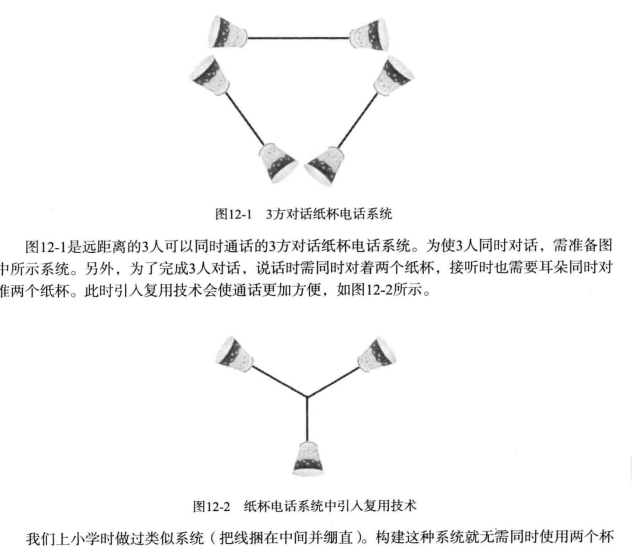

[TOC]
# 多进程服务器端

## 处理僵尸进程

\#include <sys/wait.h>  
pid_t wait(int* statloc);

- 成功时返回终止的子进程ID，失败时返回-1
- statloc包含返回信息
- 使用时通过宏对返回信息进行分离
    + WIFEXITED:if(WIFEXITED(statloc)) /是正常结束的吗？
    + WEXITSTATUS:返回子进程的返回值

pid_t waitpid(pid_t pid, int* statloc, int options);

- 成功时返回终止的子进程ID，失败时返回-1
- pid待终止的子进程pid，若传递-1则与wait函数相同，等待任意子进程终止
- options传递头文件sys/wait.h中声明的常量WNOHANG，即使没有终止的子进程也不会进入阻塞状态，而是返回0并退出函数

## 信号处理

### 信号注册
\#include <signal.h>  
void (\*signal(int signo, void (*func)(int)))(int);  

- signal函数名
- 参数：int signo, void(*func)(int)
- 返回值为函数指针，其中这个函数的参数为int
- 第一个参数为特殊情况信息，第二个参数为特殊情况下要调用的函数的指针
    + SIGALRM：已到通过调用alarm函数注册的时间（时间到）
    + SIGINT：输入CTRL+C
    + SIGCHLD：子进程终止
- 如子进程终止时，调用mychild函数：signal(SIGCHILD,mychild)
- signal(SIGALRM,timeout)
- signal(SIGINT,keycontrol)

\#include <unistd.h>  
unsigned int alarm(unsigned int seconds);

- 返回0或以秒为单位的距SIGALRM信号发生所剩时间
- 若调用的同时传递一个正整型参数n，则n秒后将产生SIGALRM信号；若传递0，则之前对信号的预约将取消

### 更常用的sigaction函数
\#include <signal.h>  
int sigaction(int signo, const struct sigaction* act, struct sigaction* oldact);

- signo传递信号处理信息，与signal()相似
- act对应于第一个参数的信号处理函数
- oldact通过此参数获取之前注册的信号处理函数指针，若不需要则传递0
- struct sigaction
    + void (*sa_handler)(int);  信号处理函数的指针
    + sigset_t sa_mask;         为了处理僵尸进程，0即可
    + int sa_flags;             0即可
- 成功时返回0，失败时返回1

### 多进程并发服务器

```c
#include <stdio.h>
#include <stdlib.h>
#include <string.h>
#include <unistd.h>
#include <signal.h>
#include <sys/wait.h>
#include <arpa/inet.h>
#include <sys/socket.h>

#define BUF_SIZE 30
void error_handling(char* message);
void read_childproc(int sig);

int main(int argc, char const *argv[])
{
    int serv_sock, clnt_sock;
    struct sockaddr_in serv_adr, clnt_adr;

    pid_t pid;
    struct sigaction act;
    socklen_t adr_sz;
    int str_len, state;
    char buf[BUF_SIZE];
    if(argc!=2){
        printf("Usage : %s <port>\n", argv[0]);
        exit(1);
    }
    act.sa_handler=read_childproc;
    sigemptyset(&act.sa_mask);
    act.sa_flags=0;
    state=sigaction(SIGCHLD, &act, 0);
    serv_sock=socket(PF_INET, SOCK_STREAM, 0);
    memset(&serv_adr, 0, sizeof(serv_adr));
    serv_adr.sin_family=AF_INET;
    serv_adr.sin_addr.s_addr=htonl(INADDR_ANY);
    serv_adr.sin_port=htons(atoi(argv[1]));

    if(bind(serv_sock, (struct sockaddr*)&serv_adr, sizeof(serv_adr))==-1)
        error_handling("bind() error");
    if(listen(serv_sock, 5)==-1)
        error_handling("listen() error");

    while(1)
    {
        adr_sz=sizeof(clnt_adr);
        clnt_sock=accept(serv_sock, (struct sockaddr*)&clnt_adr, &adr_sz);
        if(clnt_sock==-1)
            continue;
        else
            puts("new client connected...");
        pid=fork();
        if(pid==-1)
            close(clnt_sock);
        if(pid==0)      //子进程运行：
        {
            close(serv_sock);
            while((str_len=read(clnt_sock, buf, BUF_SIZE))!=0)
                write(clnt_sock, buf, str_len);

            close(clnt_sock);
            puts("client disconnected...");
            return 0;
        }
        else
            close(clnt_sock);
    }
    close(serv_sock);
    return 0;
}

void read_childproc(int sig)
{
    pid_t pid;
    int status;
    pid=waitpid(-1, &status, WNOHANG);
    printf("remove proc id: %d \n",pid);
}
void error_handling(char *message)
{
    fputs(message,stderr);
    fputc('\n', stderr);
    exit(1);
}
```

## 进程间通信

\#include <unistd.h>  
int pipe(int filedes[2]); 创建管道  

- filedes[0]通过管道接收数据时使用的fd
- filedes[1]通过管道传输数据时使用的fd
- 成功时返回0，失败时返回1


# I/O复用



利用select函数可以同时监视多个文件描述符（也可视为套接字）  

*调用方法*  

- 步骤一
    + 设置文件描述符
        * 使用fd_set数组变量将要监视的fd集中到一起（存有0和1的位数组）
        * 使用宏来操作
            - FD_ZERO(fd_set* fdset)
            - FD_SET(int fd, fd_set* fdset)
            - FD_CLR(int fd, fd_set* fdset)
            - FD_ISSET(int fd, fd_set* fdset) 若此位置包含fd信息，则返回真
    + 指定监视范围
    + 设置超时
- 步骤二
    + 调用select()
    + int select(int maxfd, fd_set* readset, fd_set* writeset, fd_set* exceptset, const struct timeval* timeout);
        * maxfd监视对象的fd数量
        * readset将所有关注“是否存在待读取数据”的fd注册到fd_set型变量，并传递其地址值
        * writeset将所有关注“是否存在可传输无阻塞数据”的fd注册到fd_set，并传递地址值
        * exceptset将所有关注“是否发生异常”的fd注册到fd_set变量，并传递地址值
        * timeout调用select函数后，为了防止陷入无线阻塞的状态，传递超时信息
        * 发生错误时返回-1，超时返回0，因发生关注的的事件返回时，返回大于0的值，且此值为发生事件的fd
- 步骤三
    + 查看调用结果

## IO复用的服务器端示例
```c
#include <stdio.h>
#include <stdlib.h>
#include <string.h>
#include <unistd.h>
#include <arpa/inet.h>
#include <sys/socket.h>
#include <sys/time.h>
#include <sys/select.h>

#define BUF_SIZE 100
void error_handling(char* buf);

int main(int argc, char const *argv[])
{
    int serv_sock, clnt_sock;//socket的fd
    struct sockaddr_in serv_adr, clnt_adr;//ip
    struct timeval timeout;
    fd_set reads, cpy_reads;

    socklen_t adr_sz;
    int fd_max, str_len, fd_num, i;
    char buf[BUF_SIZE];
    if(argc!=2){
        printf("Usage : %s <port>\n",argv[0]);
        exit(1);
    }

    serv_sock=socket(PF_INET, SOCK_STREAM, 0);
    memset(&serv_adr, 0, sizeof(serv_adr));
    serv_adr.sin_family=AF_INET;
    serv_adr.sin_addr.s_addr=htonl(INADDR_ANY);
    serv_adr.sin_port=htons(atoi(argv[1]));

    if(bind(serv_sock, (struct sockaddr*)&serv_adr, sizeof(serv_adr))==-1)
        error_handling("bind() error");
    if(listen(serv_sock, 5)==-1)
        error_handling("listen() error");

    FD_ZERO(&reads);
    FD_SET(serv_sock, &reads);
    fd_max=serv_sock;

    while(1)
    {
        cpy_reads=reads;
        timeout.tv_sec=5;
        timeout.tv_usec=5000;
        //select判断发生变化
        if((fd_num=select(fd_max+1, &cpy_reads, 0, 0, &timeout))==-1)
            break;
        if(fd_num==0)
            continue;

        for (i = 0; i < fd_max+1; ++i)
        {
            if(FD_ISSET(i, &cpy_reads))
            {
                if(i==serv_sock)//connection request
                {
                    adr_sz=sizeof(clnt_adr);
                    
                    clnt_sock=accept(serv_sock, (struct sockaddr*)&clnt_adr, &adr_sz);
                    FD_SET(clnt_sock, &reads);
                    if(fd_max<clnt_sock)
                        fd_max=clnt_sock;
                    printf("connected client: %d \n",clnt_sock);
                }
                else//read message
                {
                    str_len=read(i, buf, BUF_SIZE);
                    if(str_len==0)//close request
                    {
                        FD_CLR(i, &reads);
                        close(i);
                        printf("closed client: %d \n",i);
                    }
                    else
                    {
                        write(i, buf, str_len);//echo
                    }
                }
            }
        }
    }
    close(serv_sock);
    return 0;
}
void error_handling(char* buf)
{
    fputs(buf, stderr);
    fputc('\n', stderr);
    exit(1);
}

```


