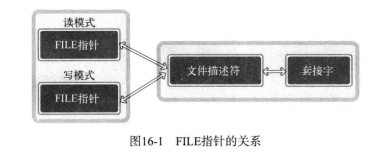

[TOC]

# 标准IO

与系统函数相比

- 优点
    + 可移植性更强
    + 效率更高
- 缺点
    + 不容易进行双向通信
    + 有时可能频繁调用fflush函数
    + 需要以FILE结构体指针的形式返回fd

fd--->FILE结构体指针  
\#include <stdio.h>  
FILE* fdopen(int fd, const char* mode);

- fd需要转换的fd
- mode将要创建的FILE结构体指针的模式信息
    + 常见的'r','w'

FILE* ---> fd
\#include <stdio.h>  
int fileno(FILE* stream);

# IO分离

读写分离

## fd的复制与半关闭

直接close()无法关闭的原因：   

### 复制fd

\#include <unistd.h>  
int dup(int fildes);  
int dup2(int fildes, int fildes2);

- fildes需要复制的fd
- fildes2明确指定的fd值
- 成功时返回复制的fd，失败时返回-1

对于FILE*的用法  
FILE* readfp = fdopen(clnt_sock, 'r');
FILE* writefp = fdopen(dup(clnt_sock), 'w');

