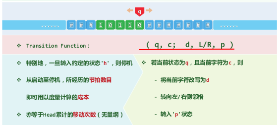
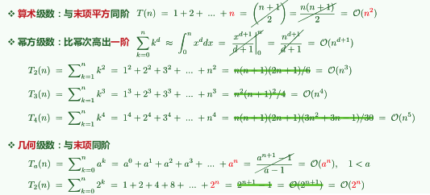
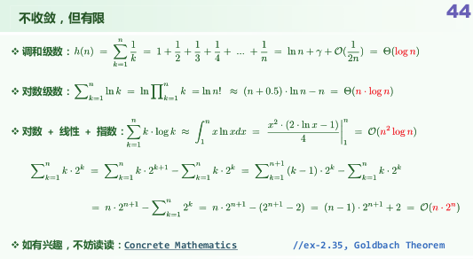
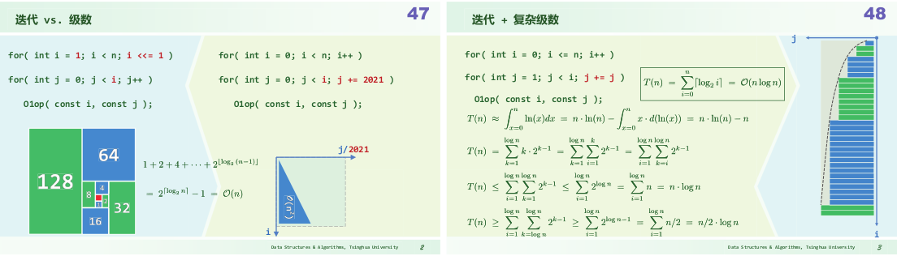
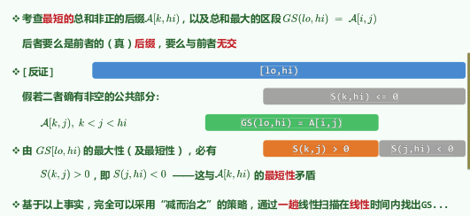
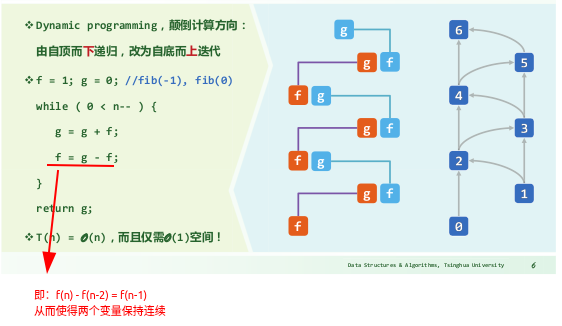
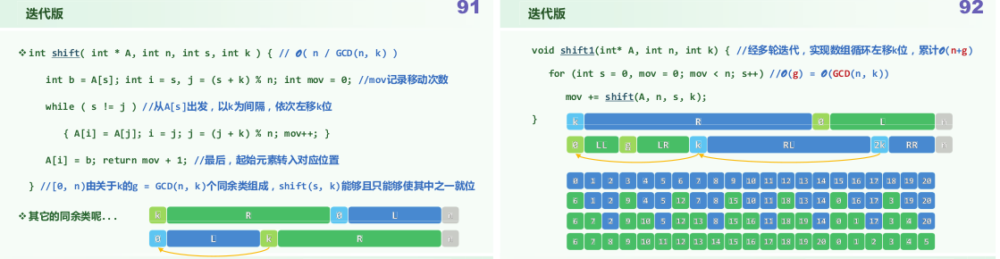
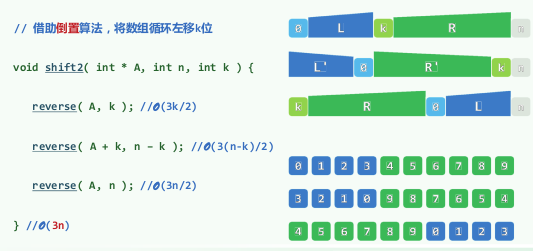

# 图灵机

Transition Function: (q当前状态, c当前字符; d改写为, L/R向左/右, p转入状态)

# 级数的复杂度

算数、幂方、几何级数：  

收敛级数：O(1)  
其他不收敛的级数：  

复杂度的图形化理解：  

# 迭代与递归

往往将递归转化为迭代可以优化算法  
最大子序列和：减治策略：  

# 动态规划

计算fib(b)：  
  
ps：记忆法Memoization也可以减少重复带来的复杂度激增

最长公共子序列

# 缓存

循环位移k：
一步就位法：

倒置法：

