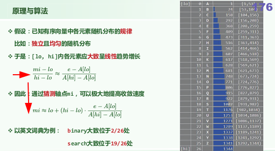
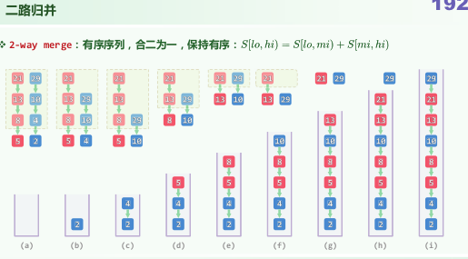
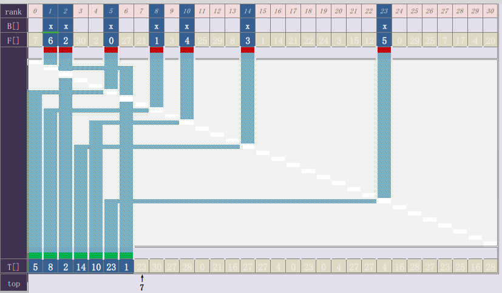

# 查找

## mi的选择

- 二分查找
  - (hi+lo)/2
  - fibonacci法
- 插值：每次迭代，子问题规模变为根号n，复杂度O(log(logn))

# 排序

## 冒泡排序的改进

用last记录最后一次逆序对的交换位置

## 归并排序

**如何归并**:将注意力放在两个有序子序列的首元素上  
  

# 位图

## 位图接口实现  

## 应用

- 去重
  - set()
- 筛法求素数

## 快速初始化

校验环：直接将top置为0

