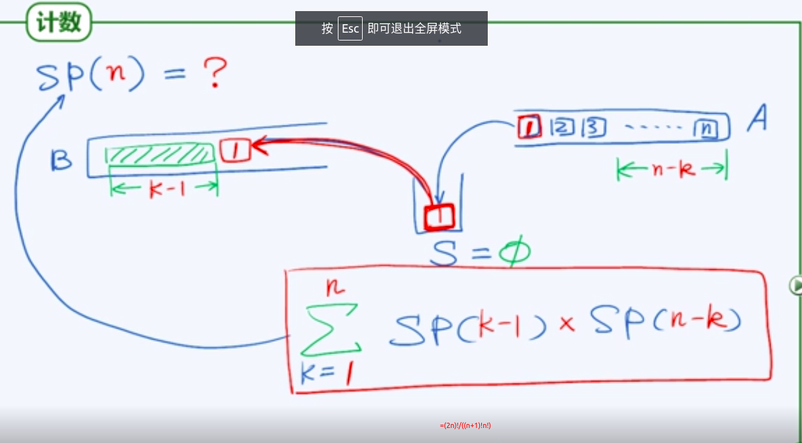

## 经典应用场景

- 逆序输出
  - 输出次序与处理过程颠倒，递归胜读和输出长度不易知：进制转换
- 递归嵌套
  - 递归分支位置和嵌套深度不固定：括号匹配，栈混洗
- 延迟缓冲
  - 线性扫描算法模式中，预读足够长后，才能确定处理的前缀：*缀表达式求和
- 栈式计算
  - ：逆波兰表达式

## 栈混洗计数

  
(2n!)/((n+1)!n!)  
卡特兰数  

## 甄别

n=3时  
栈混洗共 6!/4!/3!=5  
全排列 3!=6  
==>[3,1,2>不是栈混洗  
其中有本质的特点：任意三个元素能否按某个相对次序出现在混洗中，与其他元素无关  
推而广之：对任何1\<=i\<=j\<=k\<=n, \[..., k, ..., i, ..., j,...]必定不是栈混洗。这称之为禁型（充要条件）  

O(n)：借助栈A,B,S模拟混洗过程

## 
