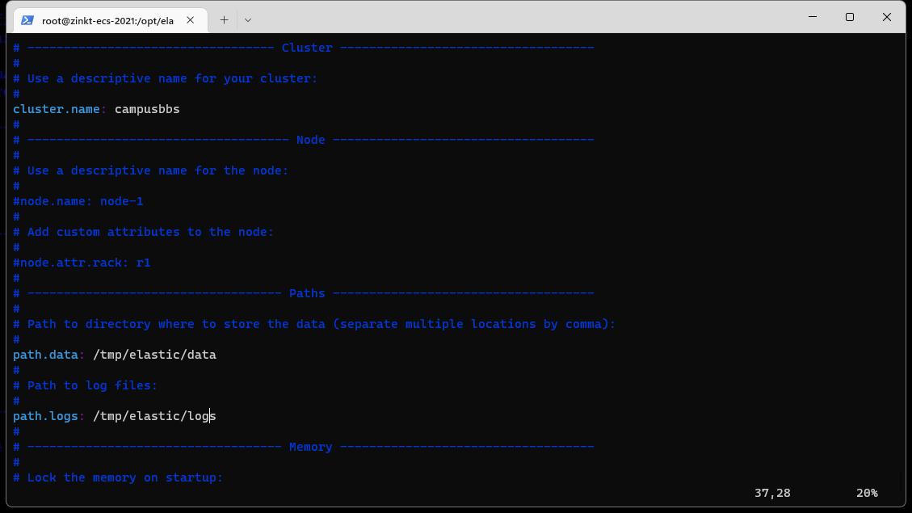
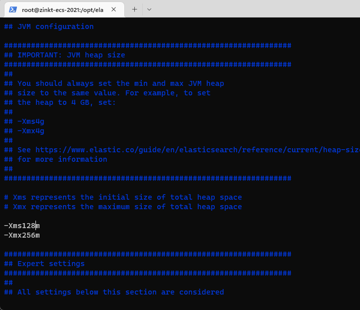
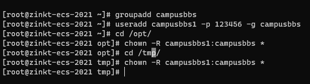
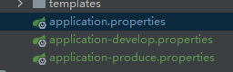

## unzip

`yum list unzip*`

`yum install -y unzip.x86_64`

## jre

`yum install java-11-openjdk.x86_64`

` java -version`

## maven

配置环境变量

`vim /etc/profile`

`export PATH=$PATH:/opt/apache-maven-3.6.1/bin`

`source /etc/profile`

在mvn安装目录`/opt/apache-maven-3.6.1/`下的conf/settings.xml中的`<mirrors></mirrors>`中加入`/opt/apache-maven-3.6.1`

## mysql

`yum install -y mysql80-community-release-el7-3.noarch.rpm`

`yum list mysql*`(一定要返回根目录再打印)

`yum install -y mysql-community-server.x86_64`

启动服务

`systemctl start mysqld`

`systemctl status mysqld`

改密码

`grep 'password' /var/log/mysqld.log`

`mysql  -u root -p`

`alter user root@localhost identified by 'Nowcoder_123';`

`create database campusbbs`

`use campusbbs`

`source /root/campusbbs-init/campusbbs.sql`

- 可能会需要允许远程连接
- `use mysql`
- `update user set host="%" where user="root" `
- `flush privileges `

## redis

` yum install -y redis.x86_64`

启动redis

`systemctl start redis`

测试

`redis-cli`

限制最大占用内存

查看（进入redis-cli）：`config get `

设置`CONFIG SET maxmemory 200MB`

置换策略`CONFIG GET allkeys-lru`

```
noeviction: 不进行置换，表示即使内存达到上限也不进行置换，所有能引起内存增加的命令都会返回error
allkeys-lru: 优先删除掉最近最不经常使用的key，用以保存新数据
volatile-lru: 只从设置失效（expire set）的key中选择最近最不经常使用的key进行删除，用以保存新数据
allkeys-random: 随机从all-keys中选择一些key进行删除，用以保存新数据
volatile-random: 只从设置失效（expire set）的key中，选择一些key进行删除，用以保存新数据
volatile-ttl: 只从设置失效（expire set）的key中，选出存活时间（TTL）最短的key进行删除，用以保存新数据
```


## kafka

`tar -zvxf kafka_2.12-2.3.0.tgz -C /opt/`

启动zookeeper

`bin/zookeeper-server-start.sh -daemon config/zookeeper.properties`

启动kafka

`nohup bin/kafka-server-start.sh config/server.properties 1>/dev/null 2>&1 &`

测试，没报错即可

`bin/kafka-topics.sh --list --bootstrap-server localhost:9092`

限制内存占用

` vim /opt/kafka_2.12-2.3.0/bin/zookeeper-server-start.sh`

`export KAFKA_HEAP_OPTS="-Xmx256G -Xms128M"`

## elasticsearch

`tar -zvxf elasticsearch-6.4.3.tar.gz -C /opt/`

`unzip -d /opt/elasticsearch-6.4.3/plugins/ik/ elasticsearch-analysis-ik-6.4.3.zip`

修改`/opt/ela...../conf/elasticsearch.yml`



修改`jvm.options`



建普通用户来启动elasticsearch



切换到新用户执行

`su  - campusbbs`

`cd /opt/elasticsearch-6.4.3/`

`bin/elasticsearch -d`

测试

切回root：`curl -X GET "localhost:9200/_cat/health/?v"`


## tomcat

` tar -zvxf apache-tomcat-9.0.22.tar.gz -C /opt/`

将其bin目录加入path（可选）

停止后，将webapps中都删掉

## 

## nginx

`yum install -y nginx.x86_64`

配置

`vim /etc/nginx/nginx.conf`

```
upstream myserver {			指tomcat
        server 127.0.0.1:8080 max_fails=3 fail_timeout=30s;
}

server {					指分发
        listen 80;
        server_name 120.24.195.104;
        location / {
                proxy_pass http://myserver;
        }
}
```

启动

`systemctl start nginx`


## 改项目文件配置

1:18:30

1. 配置文件

   1. 

   2. ```
      # profile
      spring.profiles.active=produce
      ```

   3. `server.servlet.context-path=`

   4. ```
      spring.data.elasticsearch.cluster-name=campusbbs
      ```

2. global.js`var CONTEXT_PATH = "";`

3. 新增根路径转发到index

4. pom.xml

   1. ```
      	<build>
      		<finalName>ROOT</finalName> 		!!!!
      		<plugins>
      			<plugin>
      				<groupId>org.springframework.boot</groupId>
      				<artifactId>spring-boot-maven-plugin</artifactId>
      			</plugin>
      		</plugins>
      	</build>
      ```

   2. ```
      	<description>campusBBS project for Spring Boot</description>
      	<packaging>war</packaging>		!!!
      ```

5. 